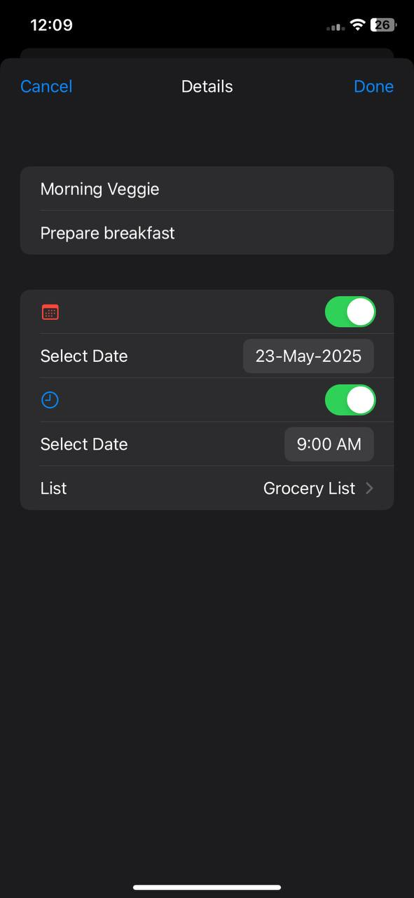

<h1 align="center">📝 MemoRise - iOS App</h1>

<p align="center">
  
  
  
  
  
</p>

**MemoRise** is a clean and functional iOS app built to replicate the core functionality of Apple’s built-in Reminders app. Designed to deepen understanding of **Core Data** and **data persistence**, MemoRise allows users to seamlessly create, manage, and track reminders and to-dos.

<br>
<p align="center">
  
</p>

---

## ✨ Features:

- ✅ **Create & Manage Reminders**  
  Add, edit, and delete custom reminders with titles, notes, and completion status.

- 💾 **Core Data Integration**  
  Demonstrates persistent data storage using Core Data with SwiftUI.

- 🌒 **Dark Mode Support**  
  Beautifully adapts to system-wide appearance with full dark mode support.

- 🧱 **MVVM Architecture**  
  Built using the **Model-View-ViewModel** design pattern for clean and maintainable code.

- 🎨 **SwiftUI Interface**  
  Entirely crafted using **SwiftUI** for a smooth and modern user experience.

---

## 📦 Requirements:

- iOS 16.0+
- Xcode 14+
- Swift 5+

---

## ⛓ Project Structure:

    MemoRise               # Root Group
    .
    ├── Extension          # Some useful extensions for date & time
    ├── Managers           # Notification Manager
    ├── Models             # CoreData Models
    │   └── EditConfig     # Object to save the state of CoreData Model values when editing an item
    │
    ├── Providers          # CoreData Provider
    ├── Services           # Reminder Services like saving, deleting, updating, etc.
    ├── Transformer        # UIColor transformer to store colour info in CoreData
    ├── Utils              # Some custom helper functions and operator
    ├── Views              # SwiftUI Views
    │
    │
    └── Preview Content    # Dummy Data Files for supporting SwiftUI Previews

---

## 🛠️ Installation:

To run this project locally:

1. Clone the repository:
    ```bash
    git clone https://github.com/deepanshubajaj/MemoRise-iOSApp.git
    ```

2. Open the project in Xcode:
    ```bash
    open MemoRise.xcodeproj
    ```

3. Build and run the app on a simulator or physical device.

> Make sure you have Xcode installed and configured properly to run the project.

---

## 🛠 Technologies Used:

- 🛠️ **SwiftUI** — Used for designing the user interface.  
- 🧪 **Xcode** — Used for development, testing, and debugging.   
- 💻 **Swift** — The core programming language powering the app.

---

## 🎨 App Look:

<p align="center">
  
  
</p>
<p align="center">
  *App snapshot in the simulator.*
</p>

---

## 🖼️ Screenshots:

<p align="center">
  
</p>

<p align="center">
  
  
  
</p>

<p align="center">
  *Splash screen displayed upon app launch in Dark Mode.*
</p>


##

<p align="center">
  
</p>

<p align="center">
  
  
  
</p>

<p align="center">
  *Splash screen displayed upon app launch in Bright Mode.*
</p>


##

<p align="center">
    
    
    
</p>

##

<p align="center">
    
    
    
</p>

##

<p align="center">
    
    
    
</p>

##

<p align="center">
    
    
    
</p>

##

<p align="center">
    
    
    
</p>


<p align="center">
  *Screenshots of the MemoRise App showing different screens in Dark Mode*
</p>

##

<p align="center">
    
    
    
</p>

##

<p align="center">
    
    
    
</p>

##

<p align="center">
    
    
    
</p>

##

<p align="center">
    
    
    
</p>

##

<p align="center">
    
    
    
</p>


<p align="center">
  *Screenshots of the MemoRise App showing different screens in Bright Mode*
</p>

## 🌄 Functionalities Demo:

<table style="width:100%">
  <tr>
    <th>Creating New List</th>
    <th>Creating New Item in List</th>
  </tr>
  <tr>
    <td><video src="https://github.com/user-attachments/assets/3a9c5c62-0259-44dc-ba95-5c76d5dce5cf" width="180" /></td> 
    <td><video src="https://github.com/user-attachments/assets/83dd8ba6-7713-417c-a7ef-126c9c11c572" width="180"/></td> 
  </tr>
  
  <tr>
    <th>Editing & Scheduling Reminder</th>
    <th>Searching for an Item</th>
  </tr>
  <tr>
    <td><video src="https://github.com/user-attachments/assets/3e36b868-43e1-4e6e-9328-e8bcca5b3f56" width="180" /></td> 
    <td><video src="https://github.com/user-attachments/assets/25e9b0de-2b91-4833-94e6-97c3fa62012b" width="180"/></td> 
  </tr>
  
  <tr>
    <th>Marking and Item as Complete</th>
    <th>Reminder Notification</th>
  </tr>
  <tr>
    <td><video src="https://github.com/user-attachments/assets/f423d141-7045-492b-99fa-9811eadeb436" width="180" /></td> 
    <td><video src="https://github.com/user-attachments/assets/f0273e7f-1532-4de0-9edd-d91359213797" width="180" /></td> 
  </tr>
</table>

---

## 📱 App Icon:

<p align="center">
  
</p>
<p align="center">
  *The App Icon reflects the MemoRise Look*
</p>

---

## 🚀 Video Demo:

Here’s a short video showcasing the app's functionality in Dark & Bright Mode:

<p align="center">
  
  
</p>


➤ <a href="ProjectOutputs/WorkingVideo/SplashScreenDVideo.MP4">🎬 Watch Splash Screen Video - [Dark Mode]</a>

➤ <a href="ProjectOutputs/WorkingVideo/SplashScreenBVideo.MP4">🎬 Watch Splash Screen Video - [Bright Mode]</a>

➤ <a href="ProjectOutputs/WorkingVideo/WorkingVideoD.MP4">🎥 Watch Working Video 1 - [Dark Mode]</a>

➤ <a href="ProjectOutputs/WorkingVideo/WorkingVideoB.MP4">🎥 Watch Working Video 2 - [Bright Mode]</a>

---

## 🤝 Contributing:

Thank you for your interest in contributing to this project!  
I welcome contributions from the community.

- You are free to use, modify, and redistribute this code under the terms of the **Apache-2.0 License**.
- If you'd like to contribute, please **open an issue** or **submit a pull request**.
- All contributions will be reviewed and approved by the author — **[Deepanshu Bajaj](https://github.com/deepanshubajaj?tab=overview&from=2025-03-01&to=2025-03-31)**.

---

### 📌 How to Contribute:

To contribute:

1. Fork the repository.

2. Create a new branch:
   ```bash
    git checkout -b feature/your-feature-name
   ```

3. Commit your changes:
   ```bash
    git commit -m 'Add your feature'
   ```

4. Push to the branch:
   ```bash
    git push origin feature/your-feature-name
   ```

5. Open a pull request.

---

## 📃 License:

This project is licensed under the [Apache-2.0 License](./LICENSE).  
You are free to use this project for personal, educational, or commercial purposes — just make sure to provide proper attribution.

> **Clarification:** Commercial use includes, but is not limited to, use in products,  
> services, or activities intended to generate revenue, directly or indirectly.


